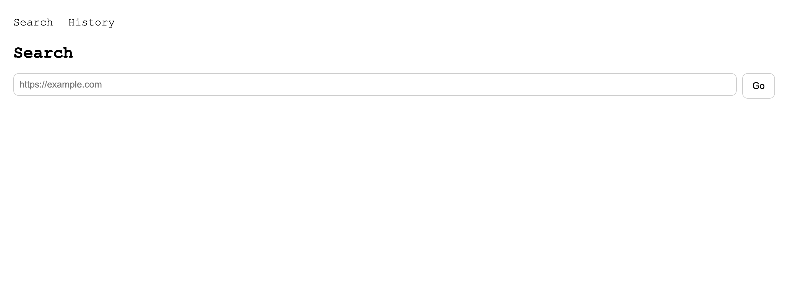
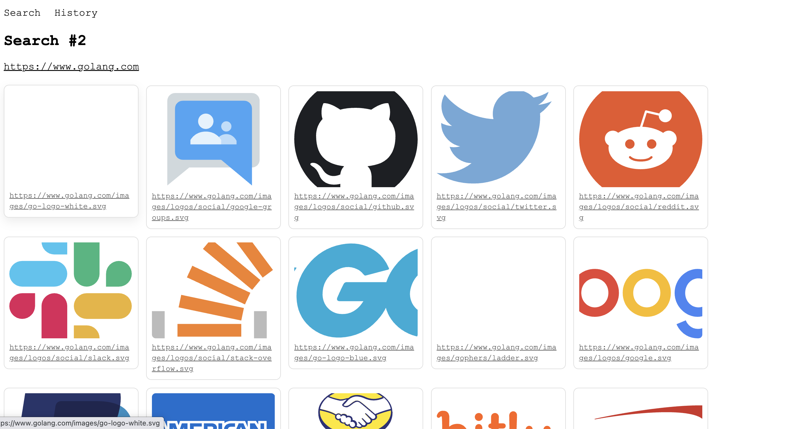

## The Problem

Create a web application capable of downloading and displaying all of the images found at a URL. In the provided repository, please create a relational database-backed web application capable of:

1. Allowing the User to enter a URL.
2. Downloading and displaying all of the images found at the URL back to the user.
3. Save the searched URL and references to the downloaded files to a database
4. Generate a navigable list of past searches that when selected will redisplay the previously downloaded files.


## Tools and Guidance

For this task we’re making use of Git version control. While experience with Git is certainly a value add, assessing your familiarity with that software is not the purpose of the exercise. Instead, if used throughout the process, Git will allow us to see your work.

You should use Python or Ruby to complete this task. In the absence of a strong personal preference, [Django](https://www.djangoproject.com/) would be a great choice.

Functionality is more important than aesthetics. While an attractive front end is appreciated, we are most interested in how you approach the problem and structure your application to address the features outlined above.

Your audience is a group of Web software developers and user experience designers. We will be looking at the application source code, HTML, and stylesheets. Be prepared to:

- demonstrate how your application operates
- tell us what choices you made while constructing it
- describe what ideas you may have for enhancing your application were you to continue development on it

## Getting started

1. Open a terminal
2. Navigate to a directory in which you’d like to store your work and checkout the project with the line below.
3. git clone https://github.com/academic-innovation/brad-floyd-engineer-interview.git

<br>
<br>

## Running Image Scraper (Django + Postgres)

Note - you will need to install Docker Desktop

```bash
cp .env.example .env

docker compose up -d --build
docker compose exec server python manage.py makemigrations
docker compose exec server python manage.py migrate
```
navigate to: [localhost:8000](http://localhost:8000/)

## Stopping Image Scraper (Django + Postgres)

```
docker compose down
```

to remove the Postgres volume as well:
```
docker compose down -v
```

## View Django server output

Once the container is running, run this command to access the django server logs:
```
docker compose logs -f server
```

## Access the Postgres Database shell (Docker)

Once the container is running, run this command to access the psql prompt:

```
docker compose exec db psql -U app -d app
````

Once some urls have been scraped, you can see the data in tables. In the psql prompt, run:

```
SELECT id, url, created_at FROM scraper_search ORDER BY created_at DESC;
```

or 

```
SELECT id, search_id, source_url, file, content_type FROM scraper_imageasset ORDER BY id DESC;
```

## Sample screenshots

   
   
   
